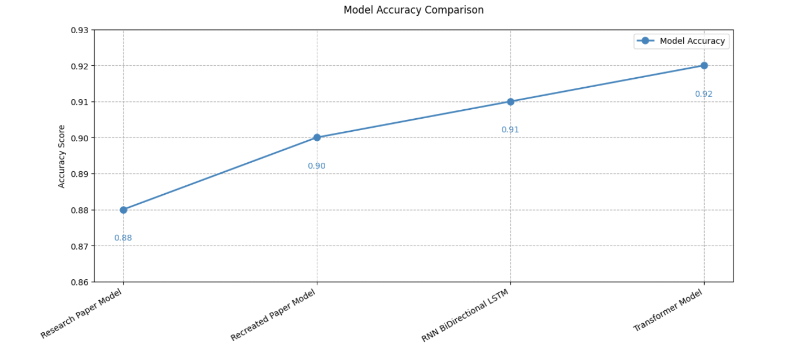
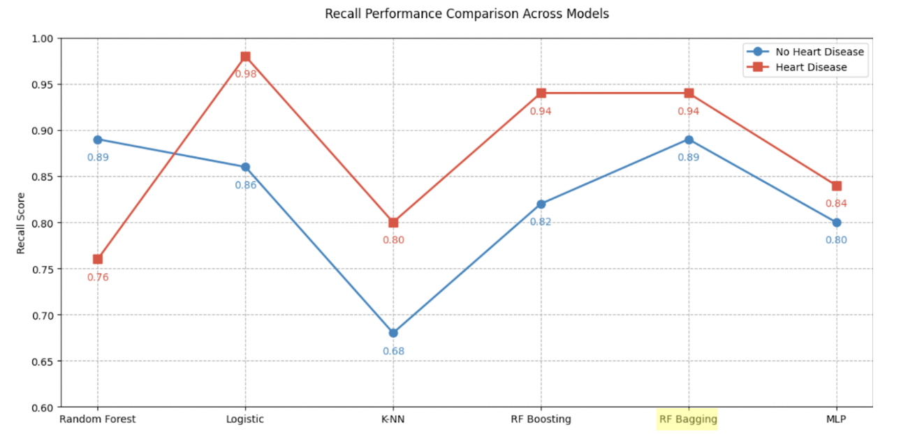

# 🧬 AI MODELS for Bio & Healthcare 🏥

## 🧪 Transposase Detection with Deep Learning

🔍 Extending research from [Wang et al. (2021)](https://www.microbiologyresearch.org/content/journal/mgen/10.1099/mgen.0.000611)

🦠 Problem:

- Detecting transposase enzymes that spread antibiotic resistance genes AMR caused 1.27M deaths and contributed to 4.95M deaths globally in 2019

🧠 Models & Results:

- Multi-Layer Perceptron: 90% accuracy
- Bidirectional LSTM: 91% accuracy
- Transformer: 92% accuracy ⭐
- +4% improvement over previous state-of-the-art (88% in Wang et al.)

💡 Key Innovations:

- K-mer frequency profiles for feature extraction
- Self-attention mechanisms in Transformer capturing sequence relationships
- Better performance with less data through advanced architectures

| Accuracy Across Models|
|:-:|
## ❤️ Heart Disease Classification with ML

🔍 Building on approaches from [Pal M et al. (2022)](https://pmc.ncbi.nlm.nih.gov/articles/PMC9206502/)

🩺 Problem:

- Predicting cardiovascular disease risk with focus on recall Heart disease: leading cause of death in US (~702,880 deaths in 2022)

📊 Models & Results:

- Rules-Based Algorithm: 52% recall baseline
- Logistic Regression: 86% recall
- Random Forest + SMOTE: 89%/79% recall (no disease/disease)
- XGBoost + Regularization: 82%/94% recall
- Bagging Classifier: 89%/94% recall ⭐ (balanced performance)

💡 Key Innovations:

- SMOTE implementation to address class imbalance
- Focus on recall optimization rather than accuracy
- L1/L2 regularization to prevent overfitting
- Ensemble methods outperforming KNN from previous research
- Parallel training with majority voting in bagging classifier

🔝 Most Important Features:

- Chest pain type
- ST depression (oldpeak)
- Maximum heart rate achieved
- Number of blood vessels (fluoroscopy)

| Recall Across Models|
|:-:|
## 👨‍💻 About Me

🧬 Computational Biology Researcher | 🤖 ML Developer | 🎓 CS @ CSUSM  
📧 josuedrew88@gmail.com | 🔗 [LinkedIn](https://www.linkedin.com/in/josue-navarrete-jbn)
